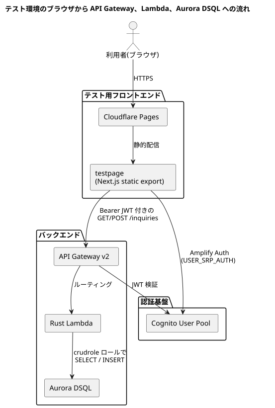

# FAQ

## テスト環境のブラウザから API Gateway、Lambda、Aurora DSQL への流れは？

補足:

- JWT の Issuer / Audience は [認証](auth.md) の CloudFormation Export を [API](api.md) が `Fn::ImportValue` で参照します。
- `testpage/` は `NEXT_PUBLIC_USER_POOL_ID`、`NEXT_PUBLIC_USER_POOL_CLIENT_ID`、`NEXT_PUBLIC_API_ENDPOINT` を [CI/CD](cicd.md) で注入して静的ビルドされます。
- DB への接続先は [データベース](db.md) の `DSQLClusterEndpoint` Export を使います。

## スタック名の接頭辞が `snngicf` なのはなぜですか？

`StackNamePrefix` の既定値が `snngicf` なのは、CloudFormation / AWS リソース名が長くなりすぎるのを避けるためです。元のリポジトリ名 `nishidemasami-github-io-contactform` を短縮した値で、[認証](auth.md)・[データベース](db.md)・[API](api.md) の各 SAM テンプレートで共通に使われています。

## Wiki を更新しても公開ドキュメントが自動再配信されないのはなぜですか？

公開ドキュメントを Cloudflare Pages へ配信するのは [CI/CD](cicd.md) の `document_cicd.yaml` ですが、このワークフローは `docs/**` を監視していません。現状の自動トリガーは `.github/workflows/document_cicd.yaml` と `testpage/**` の変更、または手動実行だけです。

そのため、`docs/` だけを更新した場合は Wiki の内容自体は Git に残っても、公開ページへ反映するには `document_cicd.yaml` を手動実行する必要があります。
