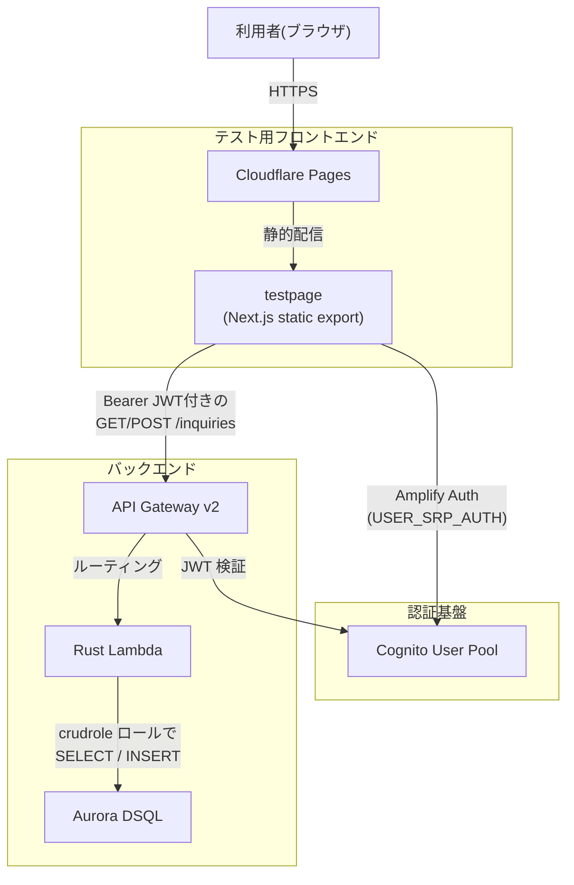

# FAQ

## テストページのブラウザから API Gateway、Lambda、Aurora DSQL への流れは？

補足:

- JWT の Issuer / Audience は [認証](auth.md) の CloudFormation Export を [API](api.md) が `Fn::ImportValue` で参照します。
- `testpage/` は `NEXT_PUBLIC_USER_POOL_ID`、`NEXT_PUBLIC_USER_POOL_CLIENT_ID`、`NEXT_PUBLIC_API_ENDPOINT` を [CI/CD](cicd.md) で注入して静的ビルドされます。
- DB への接続先は [データベース](db.md) の `DSQLClusterEndpoint` Export を使います。

## スタック名の接頭辞が `snngicf` なのはなぜですか？

`StackNamePrefix` の既定値が `snngicf` なのは、CloudFormation / AWS リソース名が長くなりすぎるのを避けるためです。元のリポジトリ名 `nishidemasami-github-io-contactform` を短縮した値で、[認証](auth.md)・[データベース](db.md)・[API](api.md) の各 SAM テンプレートで共通に使われています。

## Wiki を更新しても公開ドキュメントが自動再配信されないのはなぜですか？

公開ドキュメントを Cloudflare Pages へ配信するのは [CI/CD](cicd.md) の `document_cicd.yaml` ですが、このワークフローは `docs/**` を監視していません。現状の自動トリガーは `.github/workflows/document_cicd.yaml` と `testpage/**` の変更、または手動実行だけです。

そのため、`docs/` だけを更新した場合は Wiki の内容自体は Git に残っても、公開ページへ反映するには `document_cicd.yaml` を手動実行する必要があります。

## OpenAPI はどこを正として更新されますか？

現在の OpenAPI は API Gateway からの逆エクスポートではなく、`api/lambda/src/bin/generate-openapi.rs` が Rust コードから生成します。`api_cicd.yaml` と `document_cicd.yaml` が `API_ENDPOINT`、`USER_POOL_ID`、`CLIENT_ID` を与えて `cargo run --features openapi --bin generate-openapi` を実行し、`api/openapi.yaml` や `api/openapi-${branch}.yaml` を出力します。

そのため、契約変更が入ったときは [API](api.md) と [CI/CD](cicd.md) を一緒に見直すと追跡しやすくなります。

## 公開されるトップページの README とリポジトリ内の `docs/README.md` が少し違うことがあるのはなぜですか？

`document_cicd.yaml` は Honkit をビルドする直前に、`docs/README.md` の末尾へ公開リンクを `echo` で追記します。追記先にはコメントで「この行以降は自動でリンクが挿入される」と明記されており、公開ページにはその時点のリンク一覧が含まれます。

一方、リポジトリにコミットされる `docs/README.md` にはその追記は残さない運用なので、公開ページの末尾リンクだけが増えて見えることがあります。

## この構成で AWS の「マネージド」「スケーラブル」「Scale to Zero」をどう実現していますか？

- **マネージド**: API は [API](api.md) の Lambda + API Gateway、DB は [データベース](db.md) の Aurora DSQL を中心にして、EC2 のような常時運用前提のサーバーを避けています。
- **スケーラブル**: Lambda と Aurora DSQL を採用し、アクセス量に応じて処理能力を柔軟に拡張できる構成です。
- **Scale to Zero**: 固定稼働が前提になりやすい EC2 / RDS を主要経路から外し、従量課金中心の構成にすることで、利用が少ない時間帯のコスト最適化を狙っています。

この方針により、軽い運用負荷で高可用性・拡張性・コスト効率を両立し、クラウドの恩恵を最大限に受ける設計を目指しています。
