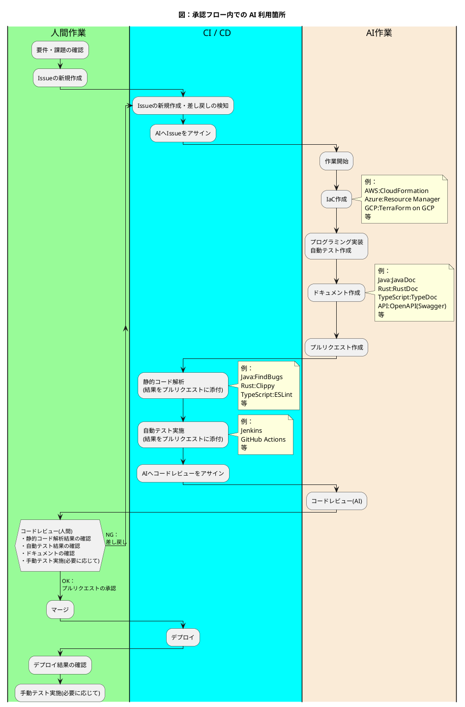

# AI開発

このプロジェクトでは、次のタスクを AI により実施しています。

- プログラムの実装
- プログラムのレビュー
- インフラの構築（IaC の編集）
- テストの作成
- ドキュメントの作成・更新

## 承認フロー内での AI 利用箇所

```plantuml
@startuml
skinparam backgroundColor transparent
''skinparam defaultFontname Meiryo
skinparam componentStyle rectangle

title 図：承認フロー内での AI 利用箇所

|#palegreen|人間作業|

:要件・課題の確認;
:Issueの新規作成;

|#aqua|CICD| CI / CD
repeat :Issueの新規作成・差し戻しの検知;
:AIへIssueをアサイン;

|#AntiqueWhite|AI作業|
:作業開始;
:IaC作成;
note right: 例：\nAWS:CloudFormation\nAzure:Resource Manager\nGCP:TerraForm on GCP\n等
:プログラミング実装\n自動テスト作成;
:ドキュメント作成;
note right: 例：\nJava:JavaDoc\nRust:RustDoc\nTypeScript:TypeDoc\nAPI:OpenAPI(Swagger)\n等
:プルリクエスト作成;
|CICD|
:静的コード解析\n(結果をプルリクエストに添付);
note right: 例：\nJava:FindBugs\nRust:Clippy\nTypeScript:ESLint\n等
:自動テスト実施\n(結果をプルリクエストに添付);
note right: 例：\nJenkins\nGitHub Actions\n等
:AIへコードレビューをアサイン;
|AI作業|
:コードレビュー(AI);
|人間作業|
repeatwhile (\nコードレビュー(人間)\n・静的コード解析結果の確認\n・自動テスト結果の確認\n・ドキュメントの確認\n・手動テスト実施(必要に応じて)\n) is (NG：\n差し戻し)
-> OK：\nプルリクエストの承認;
:マージ;
|CICD|
:デプロイ;
|人間作業|
:デプロイ結果の確認;
:手動テスト実施(必要に応じて);
@enduml
```
